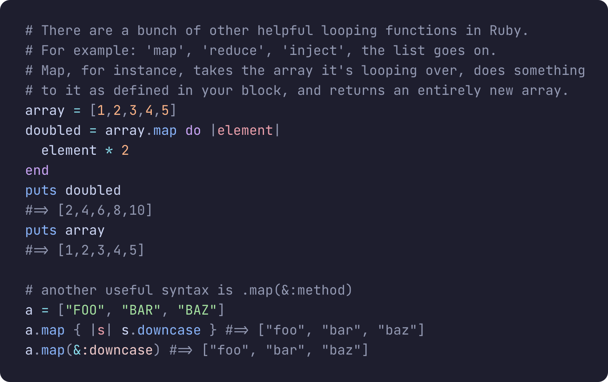
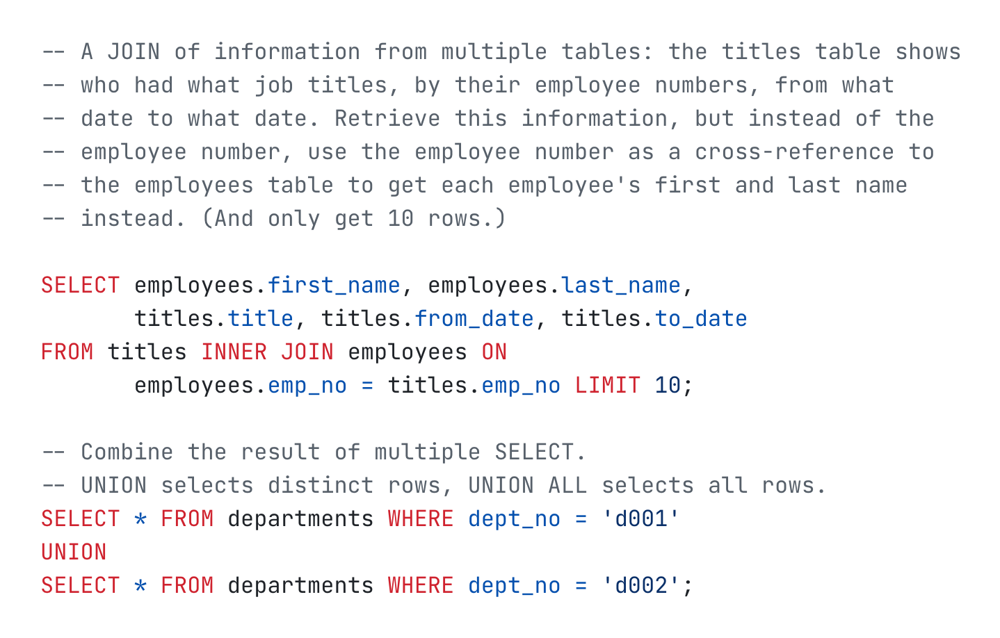

<h1 align="center">Lumis</h1>

<p align="center">
  <a href="https://lumis.sh"></a>
</p>

<p align="center">
  <a href="https://lumis.sh">lumis.sh</a>
  -
  <a href="https://lumis.sh/docs">docs</a>
</p>

<p align="center">
  <a href="https://crates.io/crates/lumis"></a>
  <a href="https://www.npmjs.com/package/@lumis-sh/lumis"></a>
  <a href="https://hex.pm/packages/lumis"></a>
  <a href="https://central.sonatype.com/artifact/io.roastedroot/lumis4j"></a>
  <a href="https://opensource.org/licenses/MIT"></a>
</p>

---

## Features

- **110+ Tree-sitter languages** - Fast, accurate, and updated syntax parsing
- **250+ built-in Neovim themes** - Updated and curated themes from the Neovim community
- **6 runtimes, one API** - CLI, Rust, Elixir, JavaScript, Browsers / CDN, and Java, aligned in naming, options, and output
- **Built-in formatters** - HTML (inline/linked), Terminal (ANSI), Multi-theme (light/dark), BBCode
- **Custom formatters** - Build your own output
- **Language auto-detection** - File extension, shebang, and emacs-mode support
- **Line highlighting** - Mark and style individual lines, with custom HTML wrappers
- **Streaming-friendly** - Handles incomplete code
- **Load parsers on demand** - Verified and cached, including injected languages

<table>
<tr>
<td></td>
<td></td>
</tr>
</table>

## Quick Start

### [CLI](https://www.npmjs.com/package/@lumis-sh/cli)

```bash
npx @lumis-sh/cli highlight app.js
```

For a global install:

```bash
npm install -g @lumis-sh/cli

lumis highlight app.js
```

### [Rust](https://crates.io/crates/lumis)

```rust
use lumis::{highlight, HtmlInlineBuilder, languages::Language, themes};

let theme = themes::get("dracula").unwrap();

let formatter = HtmlInlineBuilder::new()
    .language(Language::Javascript)
    .theme(Some(theme))
    .build()
    .unwrap();

let html = highlight("const x = 1", formatter);
```

### [JavaScript](https://www.npmjs.com/package/@lumis-sh/lumis)

Works in JavaScript runtimes including Node.js, Bun, and Deno.

```javascript
import { highlight } from '@lumis-sh/lumis'
import { htmlInline } from '@lumis-sh/lumis/formatters'
import javascript from '@lumis-sh/lumis/langs/javascript'
import dracula from '@lumis-sh/themes/dracula'

const html = await highlight('const x = 1', htmlInline({ language: javascript, theme: dracula }))
```

Parsers download on demand, including languages injected inside a document.
Browsers are the exception: loading is asynchronous there, so an injected
language has to be loaded first. See [WASM and CDN](https://lumis.sh/docs/advanced/wasm-and-cdn).

### [Browsers / CDN](https://www.npmjs.com/package/@lumis-sh/lumis)

Works in Browsers through bundlers or CDN imports.

```javascript
import { highlight } from 'https://esm.sh/@lumis-sh/lumis'
import { htmlInline } from 'https://esm.sh/@lumis-sh/lumis/formatters'
import javascript from 'https://esm.sh/@lumis-sh/lumis/langs/javascript'
import dracula from 'https://esm.sh/@lumis-sh/themes/dracula'

const html = await highlight('const x = 1', htmlInline({ language: javascript, theme: dracula }))
```

### [Elixir](https://hex.pm/packages/lumis)

```elixir
Lumis.highlight!("const x = 1", formatter: {:html_inline, language: "javascript", theme: "dracula"})
```

Parsers download on demand and load once per VM. Call
`Lumis.Languages.async_load/1` from your application's `start/2` to move the
download and compile off the first request without holding up the boot.
See [Elixir integration](https://lumis.sh/docs/usage/elixir).

### [Java](https://github.com/roastedroot/lumis4j)

By [@andreaTP](https://github.com/andreaTP). More details at https://chicory.dev/blog/syntax-highlight

```java
import io.roastedroot.lumis4j.core.Lumis;
import io.roastedroot.lumis4j.core.Lang;
import io.roastedroot.lumis4j.core.Theme;

var lumis = Lumis.builder().build();

var highlighter = lumis.highlighter()
    .withLang(Lang.JAVASCRIPT)
    .withTheme(Theme.DRACULA)
    .build();

var result = highlighter.highlight("const x = 1");
System.out.println(result.string());
```

## Documentation

| Runtime | Install | Package | Docs |
|----------|---------| ------- | -----|
| **CLI** | `npx @lumis-sh/cli` | [npmjs.com/@lumis-sh/cli](https://www.npmjs.com/package/@lumis-sh/cli) | [README.md](packages/javascript/cli/README.md) |
| **Rust** | `cargo add lumis` | [crates.io/lumis](https://crates.io/crates/lumis) | [README.md](crates/lumis/README.md) &bull; [docs.rs](https://docs.rs/lumis) |
| **Elixir** | `{:lumis, "~> 0.7"}` | [hex.pm/lumis](https://hex.pm/packages/lumis) | [README.md](packages/elixir/lumis/README.md) &bull; [hexdocs](https://hexdocs.pm/lumis) |
| **JavaScript** | `npm install @lumis-sh/lumis` | [npmjs.com/@lumis-sh/lumis](https://www.npmjs.com/package/@lumis-sh/lumis) | [README.md](packages/javascript/lumis/README.md) |
| **Browsers / CDN** | `npm install @lumis-sh/lumis` | [npmjs.com/@lumis-sh/lumis](https://www.npmjs.com/package/@lumis-sh/lumis) | [README.md](packages/javascript/lumis/README.md) |
| **Java** | `io.roastedroot:lumis4j:0.0.7` | [io.roastedroot/lumis4j](https://central.sonatype.com/artifact/io.roastedroot/lumis4j) | [README.md](https://github.com/roastedroot/lumis4j/blob/main/README.md) |

## Architecture

Every Lumis package is built around the same three pieces:

- themes extracted from Neovim
- languages backed by Tree-sitter grammars
- formatters that turn highlighted tokens into output

Given some source code, Lumis parses it with the selected Tree-sitter language, resolves styles from the chosen theme, and then formats the highlighted result into HTML, ANSI, or any custom output.

### WASM Versions

The npm [WASM package](https://www.npmjs.com/search?q=keywords:lumis-sh) versions follow the pattern `<tree-sitter-version>.<seq>` where:

- `tree-sitter-version` is the major-minor version of the compatible Tree-sitter release
- `seq` is a patch number for Lumis own updates

For example, `@lumis-sh/wasm-rust@0.26.0` is the first published version compatible with Tree-sitter 0.26,
while `@lumis-sh/wasm-javascript@0.26.1` is a patch update compatible with Tree-sitter 0.26 (usually containing upstream parser updates).

## Contributing

Contributions are welcome. Feel free to open issues or PRs for bugs, features, new themes, or languages.

See [CONTRIBUTING.md](CONTRIBUTING.md)

## Acknowledgements
* [Makeup](https://hex.pm/packages/makeup) for setting up the baseline for the Elixir package
* [Inkjet](https://crates.io/crates/inkjet) for the Rust implementation in the initial versions
* [Shiki](https://shiki.style) and [syntect](https://crates.io/crates/syntect) for the hard work defining how syntax highlighters should work

## License

MIT
