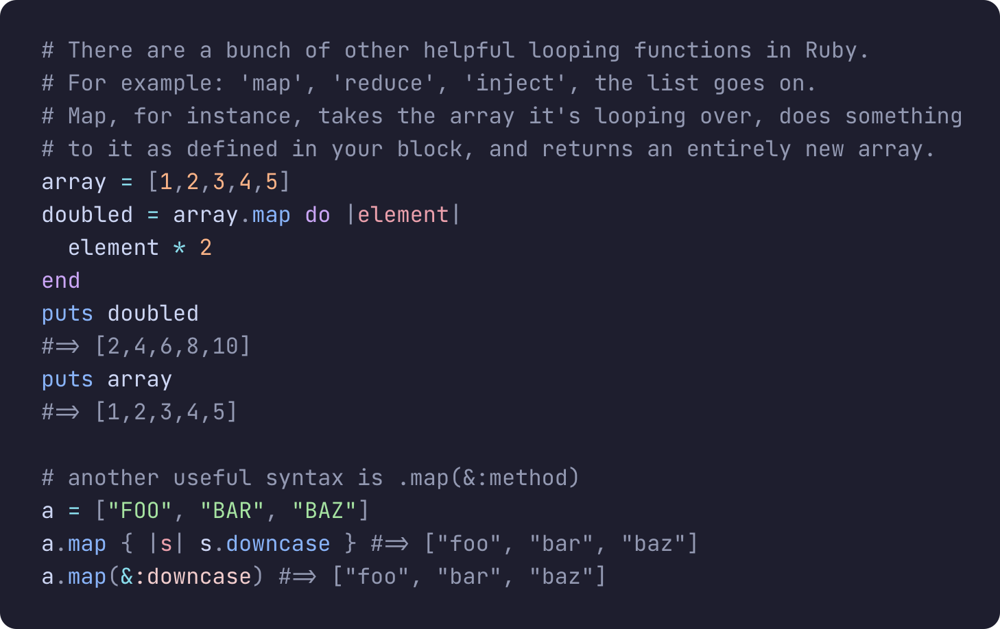
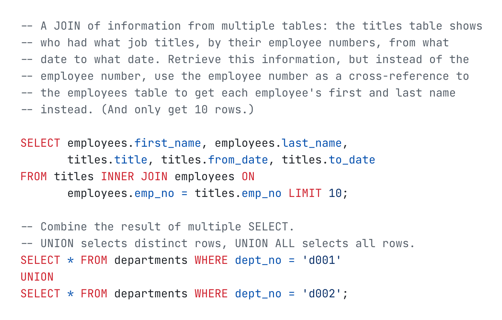

<h1 align="center">Lumis</h1>

<p align="center">
  <a href="https://lumis.sh"></a>
</p>

<p align="center">
  <a href="https://lumis.sh">lumis.sh</a>
  -
  <a href="https://docs.lumis.sh">docs</a>
</p>

<p align="center">
  <a href="https://crates.io/crates/lumis"></a>
  <a href="https://www.npmjs.com/package/@lumis-sh/lumis"></a>
  <a href="https://hex.pm/packages/lumis"></a>
  <a href="https://central.sonatype.com/artifact/io.roastedroot/lumis4j"></a>
  <a href="https://pypi.org/project/fastpylight/"></a>
  <a href="https://opensource.org/licenses/MIT"></a>
</p>

---

## Features

- **110+ Tree-sitter languages** - Fast, accurate, and updated syntax parsing
- **250+ built-in Neovim themes** - Updated and curated themes from the Neovim community
- **7 runtimes** - CLI, Rust, Elixir, JavaScript / TypeScript, and Browsers / CDN, plus community-maintained Java and Python packages
- **Built-in formatters** - HTML (inline/linked), Terminal (ANSI), Multi-theme (light/dark), BBCode
- **Custom formatters** - Build your own output
- **Language auto-detection** - File extension, shebang, and emacs-mode support
- **Line highlighting** - Mark and style individual lines, with custom HTML wrappers
- **Streaming-friendly** - Handles incomplete code
- **Load parsers on demand** - Verified and cached, including injected languages

<table>
<tr>
<td></td>
<td></td>
</tr>
</table>

## Quick Start

### [CLI](https://docs.lumis.sh/cli/install)

```bash
curl -LsSf https://lumis.sh/install.sh | sh
lumis highlight app.js
```

For a global install:

```bash
npm install -g @lumis-sh/cli

lumis highlight app.js
```

### [Rust](https://crates.io/crates/lumis)

```rust
use lumis::{highlight, HtmlInlineBuilder, languages::Language, themes};

let theme = themes::get("dracula").unwrap();

let formatter = HtmlInlineBuilder::new()
    .language(Language::JavaScript)
    .theme(Some(theme))
    .build()
    .unwrap();

let html = highlight("const x = 1", formatter);
```

### [JavaScript / TypeScript](https://www.npmjs.com/package/@lumis-sh/lumis)

Use the same package in JavaScript and TypeScript apps on Node.js, Bun, and Deno. TypeScript declarations are included.

```sh
npm install @lumis-sh/lumis @lumis-sh/themes @lumis-sh/wasm-javascript
```

```javascript
import { highlight } from '@lumis-sh/lumis'
import { htmlInline } from '@lumis-sh/lumis/formatters'
import dracula from '@lumis-sh/themes/dracula'
import javascript from '@lumis-sh/wasm-javascript'

const html = await highlight('const x = 1', htmlInline({ language: javascript, theme: dracula }))
```

Each language is its own package, and its default export is the language.
Parsers load on demand from the packages you install, including languages
injected inside a document. Browsers load only the packages you import, and
since loading is asynchronous there, an injected language has to be loaded
first. See [Languages](https://docs.lumis.sh/languages).

### [Browsers / CDN](https://www.npmjs.com/package/@lumis-sh/lumis)

Works in Browsers through bundlers or CDN imports, with the same imports.

```javascript
import { highlight } from 'https://cdn.jsdelivr.net/npm/@lumis-sh/lumis/+esm'
import { htmlInline } from 'https://cdn.jsdelivr.net/npm/@lumis-sh/lumis/dist/formatters.js'
import dracula from 'https://cdn.jsdelivr.net/npm/@lumis-sh/themes/dist/themes/dracula.js'
import javascript from 'https://cdn.jsdelivr.net/npm/@lumis-sh/wasm-javascript/+esm'

const html = await highlight('const x = 1', htmlInline({ language: javascript, theme: dracula }))
```

### [Elixir](https://hex.pm/packages/lumis)

```elixir
Lumis.highlight!("const x = 1", formatter: {:html_inline, language: "javascript", theme: "dracula"})
```

A parser is a Hex dependency, such as `{:lumis_wasm_javascript, "~> 0.26.0"}`,
and loads once per VM. Call `Lumis.Languages.async_load/1` from your
application's `start/2` to move the compile off the first request without
holding up the boot.
See [Elixir integration](https://docs.lumis.sh/usage/elixir).

### Community-maintained runtimes

The Java and Python packages have their own APIs and releases. Check their guides for supported features.

#### [Java (Lumis4J)](https://github.com/roastedroot/lumis4j)

Maintained by [@andreaTP](https://github.com/andreaTP) at [roastedroot](https://github.com/roastedroot). See the [Java guide](https://docs.lumis.sh/usage/java).

```java
import io.roastedroot.lumis4j.core.Lumis;
import io.roastedroot.lumis4j.core.Lang;
import io.roastedroot.lumis4j.core.Theme;

var lumis = Lumis.builder().build();

var highlighter = lumis.highlighter()
    .withLang(Lang.JAVASCRIPT)
    .withTheme(Theme.DRACULA)
    .build();

var result = highlighter.highlight("const x = 1");
System.out.println(result.string());
lumis.close();
```

#### [Python (fastpylight)](https://github.com/AnswerDotAI/fastpylight)

Maintained by [Answer.AI](https://github.com/AnswerDotAI). See the [Python guide](https://docs.lumis.sh/usage/python).

```sh
pip install fastpylight
```

```python
from fastpylight import highlight_spans, theme_css

html = highlight_spans("const x = 1", "javascript")
css = theme_css("dracula", "pre code")
```

Add the generated CSS to your page to apply the theme.

## Documentation

| Runtime | Install | Package | Docs |
|----------|---------| ------- | -----|
| **CLI** | `curl -LsSf https://lumis.sh/install.sh \| sh` | [GitHub Releases](https://github.com/leandrocp/lumis/releases) | [Install](https://docs.lumis.sh/cli/install) |
| **Rust** | `cargo add lumis` | [crates.io/lumis](https://crates.io/crates/lumis) | [README.md](crates/lumis/README.md) &bull; [docs.rs](https://docs.rs/lumis) |
| **Elixir** | `{:lumis, "~> 0.9"}` | [hex.pm/lumis](https://hex.pm/packages/lumis) | [README.md](packages/elixir/lumis/README.md) &bull; [hexdocs](https://hexdocs.pm/lumis) |
| **JavaScript / TypeScript** | `npm install @lumis-sh/lumis` | [npmjs.com/@lumis-sh/lumis](https://www.npmjs.com/package/@lumis-sh/lumis) | [README.md](packages/javascript/lumis/README.md) |
| **Browsers / CDN** | `npm install @lumis-sh/lumis` | [npmjs.com/@lumis-sh/lumis](https://www.npmjs.com/package/@lumis-sh/lumis) | [README.md](packages/javascript/lumis/README.md) |
| **Java (community)** | `io.roastedroot:lumis4j:0.0.7` | [io.roastedroot/lumis4j](https://central.sonatype.com/artifact/io.roastedroot/lumis4j) | [Java guide](https://docs.lumis.sh/usage/java) |
| **Python (community)** | `pip install fastpylight` | [PyPI](https://pypi.org/project/fastpylight/) | [Python guide](https://docs.lumis.sh/usage/python) |

## Community

### Community runtimes

Use [Lumis4J](https://github.com/roastedroot/lumis4j) for Java or [fastpylight](https://github.com/AnswerDotAI/fastpylight) for Python. See the [examples above](#community-maintained-runtimes) or the [community runtime guides](https://docs.lumis.sh/community#community-runtimes).

### Used by

- [Hex.pm](https://hex.pm): Highlights package source.
- [Tuist](https://tuist.dev): Highlights Markdown through MDEx.
- [Oban Pro](https://oban.pro): Highlights website code examples through MDEx.
- [mdhtml](https://github.com/AnswerDotAI/mdhtml): Optional code highlighting for Markdown through fastpylight.
- [mdhtml2docx](https://github.com/AnswerDotAI/mdhtml2docx): Optional code highlighting in Word documents through fastpylight.
- [jacko.io](https://jacko.io): Blog code blocks with light and dark themes.
- [termframe](https://github.com/pamburus/termframe): Syntax highlighting for terminal screenshots.
- [RPGMTranslate](https://github.com/RPG-Maker-Translation-Tools/rpgmtranslate-qt): Highlights code in a Qt app for translating RPG Maker games.
- [Aster](https://github.com/Wybxc/aster): Code blocks in a static site generator built with Typst.

[Full project list and integration links](https://docs.lumis.sh/community#used-by).

### Mentions

- [Lumis: Syntax Highlighter powered by Tree-sitter](https://blog.master.dev/lumis-syntax-highlighter-powered-by-tree-sitter/): Chris Coyier, Master.dev.
- [Syntax highlighting in Java, without the pain](https://chicory.dev/blog/syntax-highlight/): Andrea Peruffo, on building Lumis4J.
- [Leandro Pereira on MDEx](https://www.youtube.com/watch?v=IyDNtqlClhU): Elixir Mentor interview covering MDEx, Lumis, and open source.

[All mentions](https://docs.lumis.sh/community#mentions). To add your project or a mention, send a PR to the [Community page](docs/content/community.md).

## Architecture

Every Lumis package is built around the same three pieces:

- themes extracted from Neovim
- languages backed by Tree-sitter grammars
- formatters that turn highlighted tokens into output

Given some source code, Lumis parses it with the selected Tree-sitter language, resolves styles from the chosen theme, and then formats the highlighted result into HTML, ANSI, or any custom output.

### WASM Versions

The npm [WASM package](https://www.npmjs.com/search?q=keywords:lumis-sh) versions follow the pattern `<tree-sitter-version>.<seq>` where:

- `tree-sitter-version` is the major-minor version of the compatible Tree-sitter release
- `seq` is a patch number for Lumis own updates

For example, `@lumis-sh/wasm-rust@0.26.0` is the first published version compatible with Tree-sitter 0.26,
while `@lumis-sh/wasm-javascript@0.26.1` is a patch update compatible with Tree-sitter 0.26 (usually containing upstream parser updates).

## Contributing

Contributions are welcome. Feel free to open issues or PRs for bugs, features, new themes, or languages.

See [CONTRIBUTING.md](CONTRIBUTING.md)

## Acknowledgements
* [Makeup](https://hex.pm/packages/makeup) for setting up the baseline for the Elixir package
* [Inkjet](https://crates.io/crates/inkjet) for the Rust implementation in the initial versions
* [Shiki](https://shiki.style) and [syntect](https://crates.io/crates/syntect) for the hard work defining how syntax highlighters should work

## License

MIT
